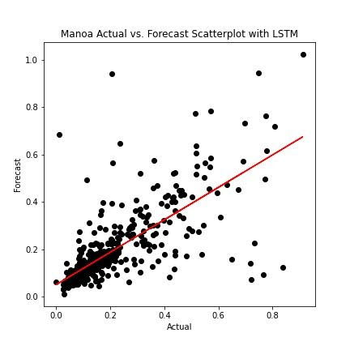
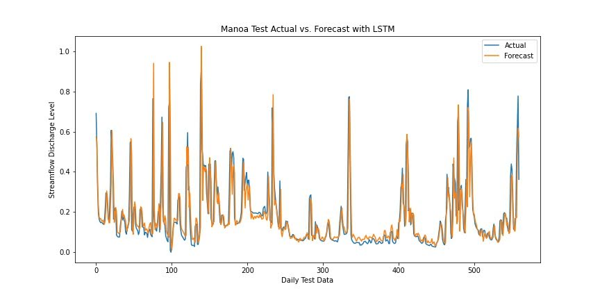
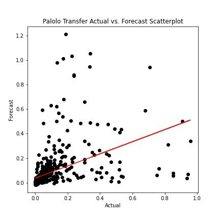
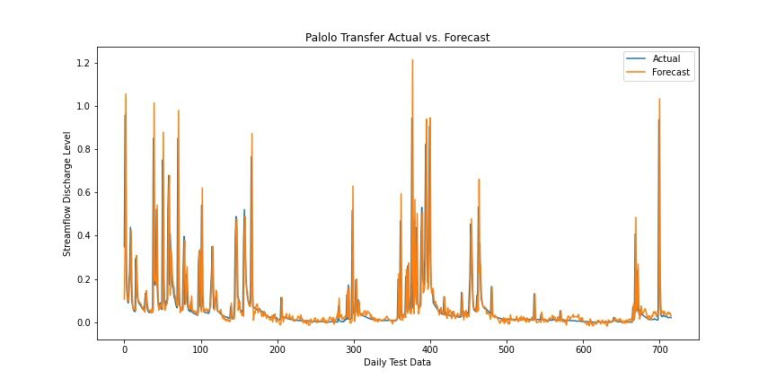

# Streamflow Forecasting With Machine Learning 

## Authors:

Brody Uehara1, Trista McKenzie2, Henrietta Dulai2

## Affiliations:

1 Department of Information and Computer Science, University of Hawaiʻi at Mānoa, Honolulu, HI, 96822, USA

2 Department of Earth Science, University of Hawaiʻi at Mānoa, Honolulu, HI, 96822, USA

## Abstract:
In response to the critical need for stream discharge information in Hawaiʻi for water budget management, pollution transport understanding, and ecosystem studies, this study employs deep learning techniques to forecast streamflow discharge. Leveraging recurrent neural networks (RNNs), including Long Short-Term Memory (LSTM) units, Bidirectional LSTMs, and Gated Recurrent Units (GRUs), we model the streamflows of the Mānoa, Makiki, and Pālolo Streams on the island of Oʻahu. Utilizing observed precipitation and meteorological data, our models demonstrate the potential of deep learning in tropical island settings for stream discharge prediction, offering a basis for transfer learning to streams lacking discharge records. This work contributes to the ‘Ike Wai project, aimed at enhancing the understanding of Hawaiʻi's waterways through a collaborative research effort.

## 1. Introduction

Hawaiʻi's freshwater streams, integral to the island's water budgets, ecosystems, and cultural heritage, face challenges in monitoring due to technical and financial constraints. The ‘Ike Wai project, supported by the National Science Foundation, aims to address these challenges by applying deep learning methods to forecast streamflow levels in streams lacking reliable data. This paper discusses the project's approach, focusing on RNNs' application to predict stream discharge and the potential for transfer learning across different streams.

## 2. Methods

### 2.1 Data Collection and Preparation

Data for the Mānoa Stream, including streamflow levels and meteorological variables like temperature and humidity, were collected from the US Geological Survey and World Weather Online. Data preprocessing involved filtering missing values, outlier removal, and normalization to prepare for model training.

### 2.2 Model Training and Selection

We trained several RNN variants, including LSTMs, Bidirectional LSTMs, and GRUs, evaluating their performance in forecasting daily streamflow discharge. The training process involved optimizing model parameters on a validation dataset to minimize prediction errors.

<table>
  <tr>
    <td>  </td>
    <td>  </td>
  </tr>
</table>

### 2.3 Transfer Learning Application

The best-performing model, identified as the regular LSTM, was then applied to predict the streamflow of Palolo and Makiki Streams using the learned weights from the Mānoa Stream model, demonstrating the transfer learning approach's efficacy.

<table>
  <tr>
    <td>  </td>
    <td>  </td>
  </tr>
</table>

## 3. Results

The LSTM model exhibited robust performance in forecasting streamflow discharge, capturing the seasonal variability and peak rainfall events. The application of the model to Palolo and Makiki Streams using transfer learning showed similar predictive accuracy, validating the approach for streams lacking direct discharge data.

## 3.1 Statistical Results

For the Mānoa stream, the model achieved a Test Root Mean Square Error (RMSE) of 0.107 and a coefficient of determination (R\^2) of 0.54. The RMSE value indicates the standard deviation of the residuals (prediction errors). A lower RMSE value indicates a better fit to the data. In this context, an RMSE of 0.107 means that the model's predictions are, on average, approximately 0.107 units away from the actual observed values.

The R\^2 value, also known as the coefficient of determination, measures the proportion of the variance in the dependent variable that is predictable from the independent variable(s). An R\^2 of 0.54 means that 54% of the variability in the streamflow can be explained by our model. This is a moderate level of predictive power.

For the Palolo stream, the model achieved a Test RMSE of 0.145. This higher RMSE value compared to the Mānoa stream indicates that the model's predictions for the Palolo stream are, on average, approximately 0.145 units away from the actual observed values. This suggests that the model's predictions for the Palolo stream are slightly less accurate than for the Mānoa stream.

## 4. Discussion

The study highlights deep learning's potential to overcome data limitations in stream discharge monitoring. The success of transfer learning in applying a model trained on one stream's data to others suggests a scalable solution for broader geographic applications. Challenges, such as model generalization and data variability, are discussed, along with the implications for water management and ecological studies.

## 5. Conclusion

This research demonstrates that deep learning, particularly RNNs, can effectively predict streamflow discharge in Hawaiʻi, offering a promising tool for water resource management. The successful application of transfer learning opens avenues for extending this approach to other regions with similar constraints.

**Acknowledgements:**

- Tom Giambelluca

**Funding:**

This project was supported by the Hawaiʻi EPSCoR Program under National Science Foundation award number EPS-0903833 and the National Science Foundation’s Research Infrastructure (RII) Track-1: ʻIke Wai: Securing Hawaii’s Water Future Award #OIA 1557349.

**Disclaimer:**

Any opinions, findings, and conclusions or recommendations expressed in this material are those of the author(s) and do not necessarily reflect the views of the National Science Foundation.